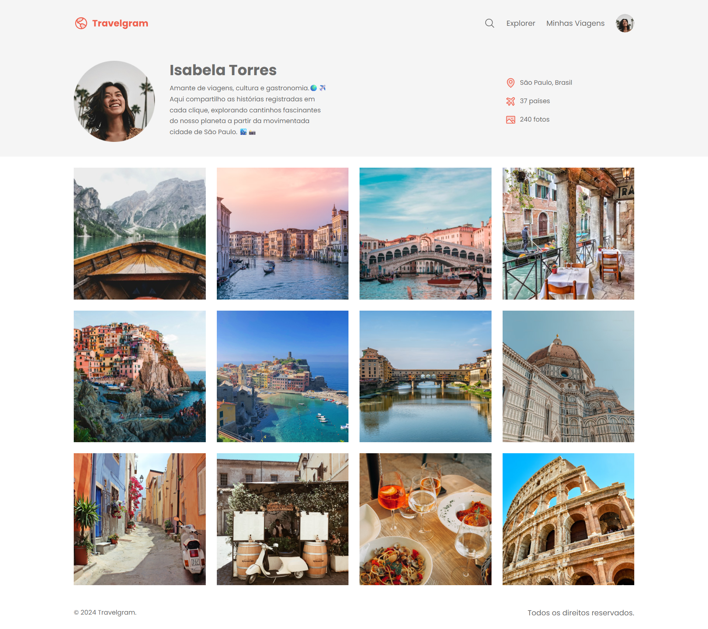

# ✈️ Travelgram

Um projeto de interface de perfil de viagens construído para consolidar os fundamentos de desenvolvimento web e estilização.

## 💻 Sobre o Projeto
O Travelgram é uma página web estática que simula o perfil de um viajante, contendo um cabeçalho de navegação (navbar) e uma área de apresentação de usuário moderna e alinhada. 

## 🚀 Tecnologias e Ferramentas
* **HTML5:** Semântica e estruturação da página.
* **CSS3:** Estilização, uso de variáveis globais (`:root`) e Flexbox.

## 🧠 Evolução e Aprendizados
Durante o desenvolvimento dessa interface, pude praticar o "estudo ativo" focando na resolução de problemas reais de layout. Os principais conceitos aplicados foram:
* Criação e importação de múltiplos arquivos CSS para manter o projeto modular e organizado (`global.css`, `index.css`, `nav.css`).
* Uso de **Flexbox** (`display: flex`, `justify-content`, `align-items`) para alinhar itens perfeitamente no cabeçalho.
* Implementação da classe `.container` para centralizar e limitar a largura do conteúdo em telas grandes.
* "Debugging" e correção de bugs visuais de herança de estilos.

## 📸 Prévia
